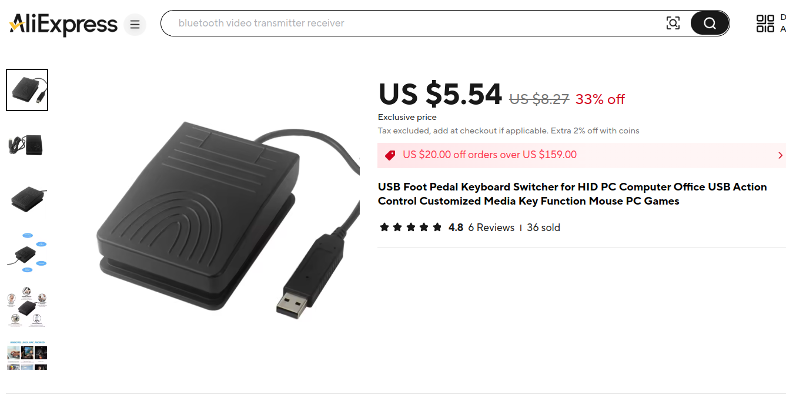
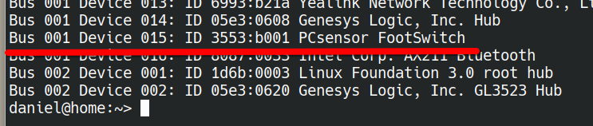
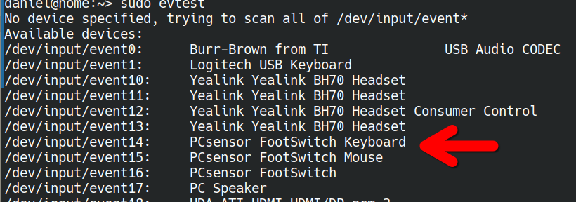
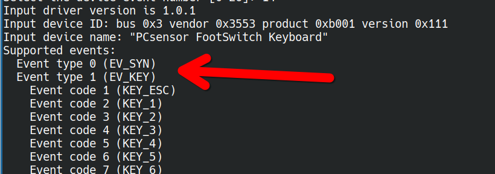
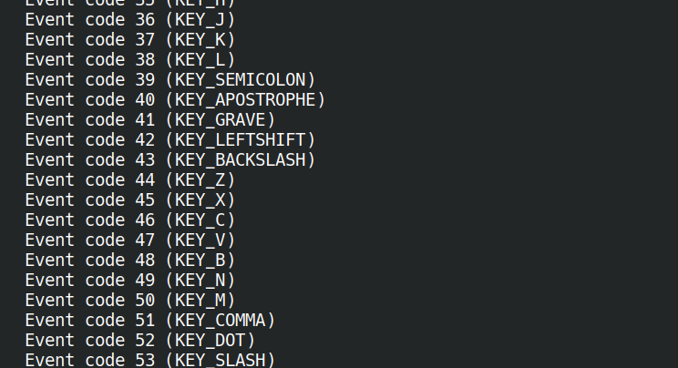
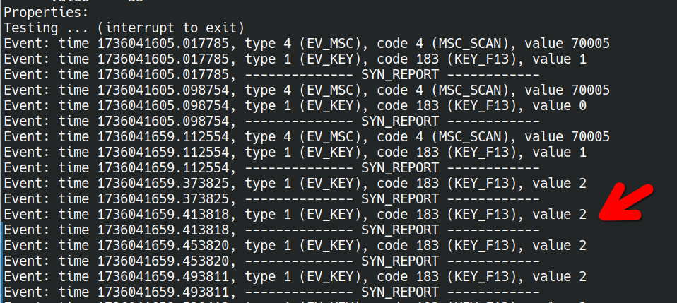

# USB HID foot pedal Linux configuration (OpenSUSE Tumbleweed)

This repository contains some simple documentation describing how I got a cheap USB foot mouse purchased on AliExpress to give the desired key (F13) on OpenSUSE Tumbleweed Linux. 

There are plenty of more elegant ways to do key mappings on Linux, such as the Input Remapper GUI. Unfortunately, I ran into issues getting that to run automatically on boot, so instead I reversed it to HWDP, a low-level utility, as a workaround solution. 

Lest this documentation be of assistance to any other Linux users trying to get generic USB hardware to work on their computers, I said I would share the setup steps. 

## Generic USB HID Foot Mouse

As a recent adoptee of the world of voice typing, I wanted to pick up a USB foot pedal in order to provide a single keystroke to start and stop the dictation stream. The excellent [Whisper AI Chrome extension](https://chromewebstore.google.com/detail/whisperai-ai-driven-speec/klhcnkknganbneegjihbcfjoifiomhfn?hl=en), which I highly recommend, allows for a shortcut to be configured both as a tap shortcut and as a holding down shortcut. So this seemed perfect for a foot pedal. 

To try out a foot pedal without investing too much, I picked up a cheap, generic USB HID device on AliExpress. Something very like this:



As is frequently the case with USB hardware sold on AliExpress, there was virtually no identifiable product name, driver support, or really much to configure the device. When I unboxed this and connected it to my computer, I saw that it was putting out “b”.  One option would have been to use PC Controls on Windows to edit the firmware with EEPROM (and this would be the recommended approach if you wanted to use the foot mouse between systems and have it provide a consistent output.)

But if you're happy to have the binding just attached to your computer, you can use HWDB to configure a custom mapping. This provides a low-level remapping of the key so that it's no longer interpreted as B and is edited to your preferred key or key combination. 

## Get Device ID Using lsusb

The first step is to run `lsusb`in order to identify the device ID. 

We can see that this particular device is `3553:b001`:



## Use evtest To Learn Depress Event

Next, you will want to run sudo evtest in order to identify the press event that you want to map. 

You might see multiple events for the identified piece of hardware. For the purpose of passing macro keys from key presses, the one you want is the keyboard event, In this case 14. 



Once we've done this, we can begin to understand the commands that the hardware is giving and which the operating system is interpreting



This particular device had a long list of event codes, so I scrolled down until I found the event code corresponding to the key that I wanted the depression of the foot pedal to provide, F13. 



That's:

` Event code 183 (KEY_F13)`


## Test Pressing The USB Pedal

Next, you'll want to press the pedal a couple of times and watch the output of the terminal to see what events correspond to the pressing and release of the foot pedal. 

Given that lots of transription tools support functions whereby holding down the pedal keeps the transcription going (push to talk!) you'll usually find depress and release events having separate identifiers:



The terminal output above was generated by me firstly tapping the pedal, then holding it down. 

We can see that there are three different key states that were generated:

- Value one corresponds to tapping the pedal
- Value two corresponds to holding the pedal down. This is the "PTT" (like) eventWhat is the scan code? What does that do exactly? 
- Value zero is the release event 

 ## Creating HWDB Entry

 To create the HWDB entry, I used:

 `sudo nano /etc/udev/hwdb.d/70-keyboard.hwdb`

 And this was the content for the rule. 

 ```
 evdev:input:b0003v3553pB001*
 KEYBOARD_KEY_70005=key_f13
 ```

You'll need to replace all of the values with those that you get from the product scan and with the key that you want to map onto. 

And after saving that rule, you'll want to run this:

```
sudo systemd-hwdb update
sudo udevadm trigger
```
 
The mapping isn't specific to a USB port, so the rules should work regardless of which port you connect it to. The value states are handled at the input event level and in my case, for this foot pedal and the Chrome extension that I'm using, it all works perfectly. 

By way of reminder and as stated above: HWDB is an effective low level Linux tool that is In most mainstream distributions. But all this system modification is doing is affecting the mapping for this USB device on this system. The on device firmware is not being rewritten. So if you want to use the same device on multiple computers, you'd need to have a corresponding rule on every machine. Alternatively, you can use a Windows computer and PC Control. Or by a better quality USB foot pedal that has support for Linux and allows configuration of the firmware directly.

## Use Case Statement

## Author

Daniel Rosehill  
(public at danielrosehill dot com)

## Licensing

This repository is licensed under CC-BY-4.0 (Attribution 4.0 International) 
[License](https://creativecommons.org/licenses/by/4.0/)

### Summary of the License
The Creative Commons Attribution 4.0 International (CC BY 4.0) license allows others to:
- **Share**: Copy and redistribute the material in any medium or format.
- **Adapt**: Remix, transform, and build upon the material for any purpose, even commercially.

The licensor cannot revoke these freedoms as long as you follow the license terms.

#### License Terms
- **Attribution**: You must give appropriate credit, provide a link to the license, and indicate if changes were made. You may do so in any reasonable manner, but not in any way that suggests the licensor endorses you or your use.
- **No additional restrictions**: You may not apply legal terms or technological measures that legally restrict others from doing anything the license permits.

For the full legal code, please visit the [Creative Commons website](https://creativecommons.org/licenses/by/4.0/legalcode).